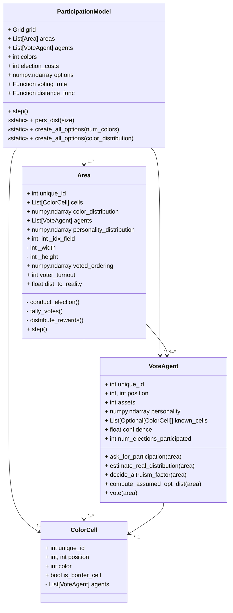

# Project Summary

DemocracySim explores how voting rules impact participation and welfare 
in an evolving environment that is influenced by agents' group decisions. 
The framework enables **dynamic simulations** where agents interact with their environment 
and adapt their strategies to maximize rewards.

---

### Core Components

#### **Grid-Based Mesa Model**
- A grid-based world containing cells, which represent states with colors (e.g., `white`, `red`, `green`, `blue`).
- Elections within *areas* of the grid influence color transitions.
- Wrap-around boundaries avoid border effects.

## `ColorCell` Class Documentation

   ::: path.to.your.module.ColorCell

### Attributes

- **`color`**: 
  - **Type**: `Color`
  - **Description**: The `color` attribute defines the current color of the `ColorCell`. A `Color` object may represent RGB values, color names, or any other color representation.
  - **Default Value**: `None` (or specify the default if applicable).
  - **Purpose**: Used to identify and differentiate cells by their color.

### Methods

- **`setColor(color: Color)`**: Sets the color of the `ColorCell` to the specified value.
- **`getColor() -> Color`**: Returns the current color of the `ColorCell`.

---

For additional details on the `Color` class, see the [Testlink](#Attributes).  

#### **Agents**
- Decision-making units equipped with:
    - **Personality vectors**: Represent color preferences.
    - **Assets**: Manage a budget when making decisions.
    - **Decision logic**: Participate in elections or not, cast their vote strategically.

#### **Elections**
- Take place inside instances of the `Area` class.
- Options to vote upon represent color rank vectors.
- Are held periodically in *areas* and or globally.
- Outcomes:
    - Influence the color mutation of cells in the *area*.
    - Determine rewards for all agents in the area.

#### 4. **Reward Mechanisms**
- Rewards depend on:
    - Proximity to the objective "truth" (closeness of the decided color ranking 
      to the "real" color frequency distribution within the area).
    - Distributed according to both egalitarian and preference-based weighting.

---

### Class Overview of the Environment

