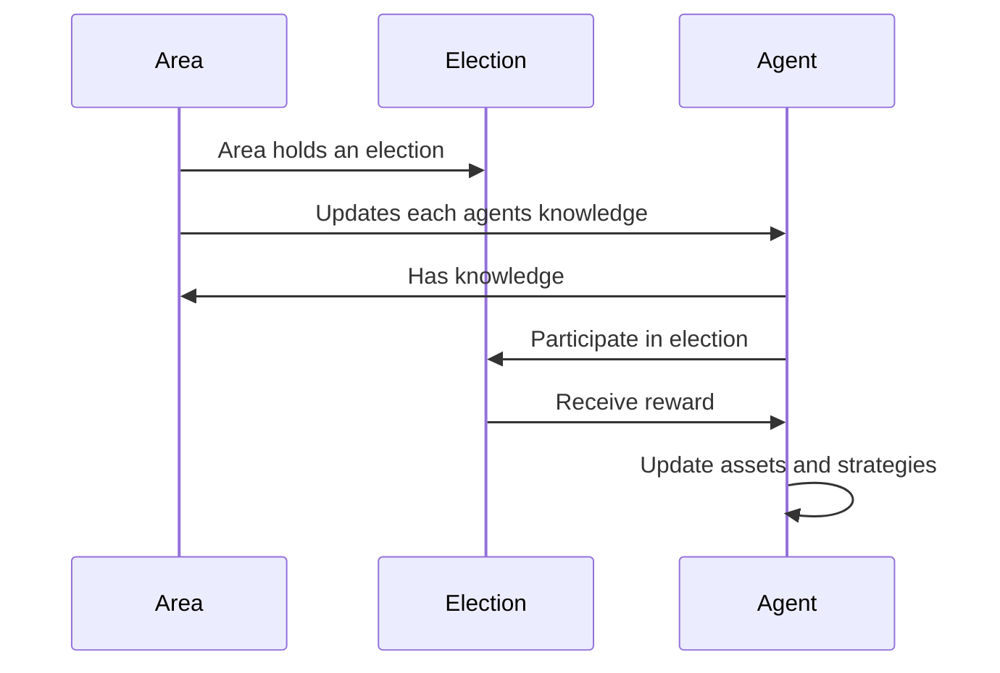

# Simulation Environment

The environment in DemocracySim is structured as a grid, where elections and agent interactions occur.

---

### Features
1. **Dynamic Environment**:
    - The grid is composed of cells, each representing a state with a specific color.
    - Elections in areas of the grid drive state transitions.

2. **Mutations and Elections**:
    - Mutations are applied to the grid, introducing randomness.
    - Voting outcomes reflect agent personalities and decision-making.

---

#### Area Workflow

