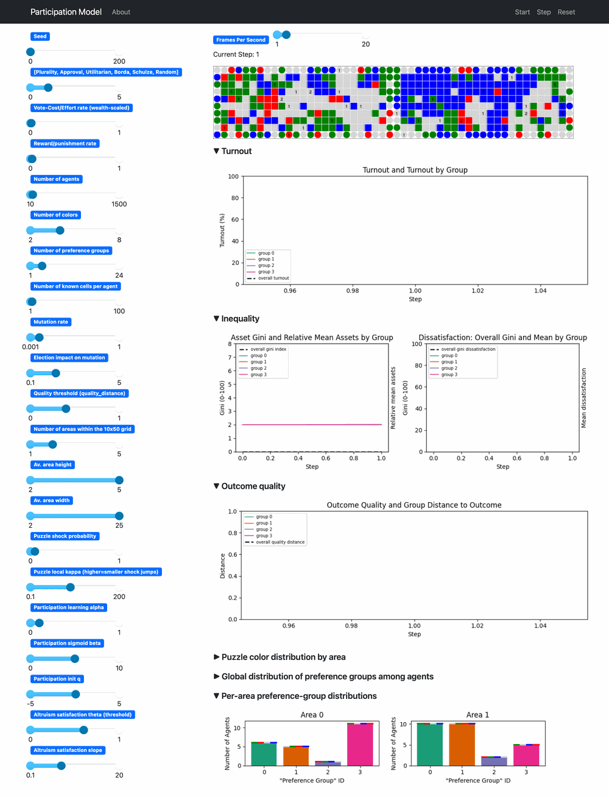
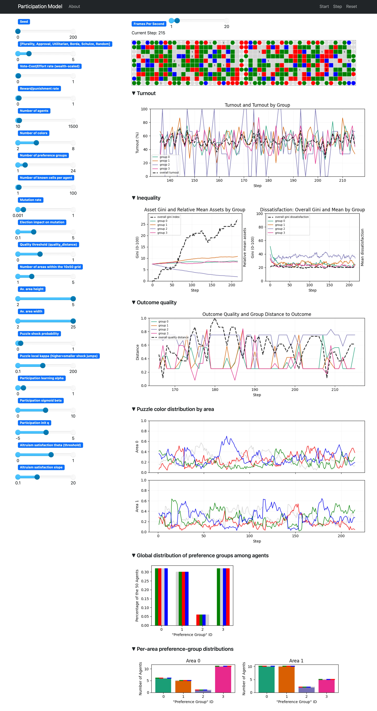

# Demo

This is the quickest local path into DemocracySim. The demo config is small
enough to run in seconds, but still shows the main feedback loop between
elections, participation, inequality, and changing grid conditions.



## Demo Config

[configs/demo.yaml](https://github.com/jurikane/DemocracySim/blob/main/configs/demo.yaml)
uses a compact setup:

- 50 agents
- 4 colors
- 4 preference groups
- 2 areas
- one headless run with replay output

## Generate And Replay

Create a local environment once:

```bash
python -m venv .venv
source .venv/bin/activate
pip install -r requirements.txt
```

Generate a demo run:

```bash
python -m scripts.run_headless --config configs/demo.yaml --out-root tmp/demo_gif_run
```

Replay the stored run:

```bash
python -m scripts.run_replay tmp/demo_gif_run/run_0
```

Or start an un-seeded live demo:

```bash
python -m scripts.run --config configs/demo.yaml
```

## What To Look At In The UI



The screenshot above shows the live server at a later step of the demo run. The
main things worth reading are:

- The grid at the top shows the current election-time world state. It is the
  realized color distribution after earlier mutation and before the next round
  of decisions. For the background, see
  [environment_dynamics.md](environment_dynamics.md) and
  [grid_state_concept.md](../research/grid_state_concept.md).
- The `Turnout` section shows both the overall participation trajectory and the
  grouped turnout series. This is the clearest entry point for the thesis
  question about participation dynamics. For the update logic behind it, see
  [participation_learning.md](participation_learning.md).
- The `Inequality` section combines two views: asset inequality and relative
  mean assets by group on the left, and dissatisfaction inequality plus group
  means on the right. These are the two main inequality families used in the
  thesis. For the underlying mechanics, see
  [core_mechanics.md](core_mechanics.md) and
  [thesis_measurement_spec.md](../research/thesis_measurement_spec.md).
- The `Outcome quality` section shows the quality trajectory together with group
  distance to the elected outcome. This is where the model's quality target and
  group alignment become visible over time. See
  [puzzle_quality_gate_concept.md](../research/puzzle_quality_gate_concept.md)
  and [voting_rules.md](voting_rules.md).
- `Puzzle color distribution by area` shows the moving puzzle target in each
  area. In puzzle mode, this is the quality reference against which elected
  orderings are judged. See
  [puzzle_quality_gate_concept.md](../research/puzzle_quality_gate_concept.md).
- The preference-group panels at the bottom show how agents are distributed
  across groups globally and by area. They help interpret the grouped turnout,
  inequality, and outcome-distance series above. See
  [population_preferences.md](population_preferences.md).

## Replay Your Own Run

Replay is deterministic because it reads recorded run artifacts rather than
resimulating the model.
Replay any stored run with:

```bash
python -m scripts.run_replay <run_dir>
```

Or search for runs interactively in `data/`:

```bash
python -m scripts.run_replay
```

Generate summary artifacts for a stored run:

```bash
python -m scripts.generate_summary --run-dir <run_dir>
```
